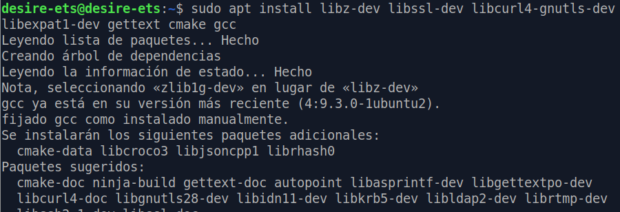
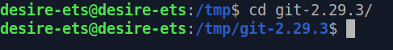

# Instalación de Git en Linux

<div align="center">


</div>

### Requisitos previos

<div style="text-align: justify">

Antes de proceder a la realización de la instalación de git, deberemos tener un equipo o una máquina virtual, con un sistema operativo Linux y deberemos contar con una cuenta con permisos de administrador (**Root**).

</div>

## Índice

 1.[Instalación de Git con paquetes predeterminados](#id1)

 2.[Instalación de Git desde la fuente](#id2)

 3.[Configuración de Git](#id3)

## 1. Instalación de Git con paquetes predeterminados <a name="id1"></a>

<div style="text-align: justify">

Primero probaremos a instalar git con paquetes predeterminados y con la versión más estable y reciente disponible. Esto nos servirá para empezar a utilizar Git en el equipo de una manera más rápida.

Antes de instalarlo comprobaremos si ya tenemos una versión disponible con el siguiente comando.

</div>

````
git --version
````

<div align="center">


</div>

<div style="text-align: justify">

Si no nos aparece una versión instalada, procederemos a ejecutar el comando que nos recomienda para la instalación. O si simplemente queremos tener una versión instalada más actual.

Primero actualizaremos los paquetes, por si algún paquete se encuentra desactualizado.

````
sudo apt update
````

<div align="center">


</div>

Luego de la actualización, podremos instalar Git.

````
sudo apt install git
````

<div align="center">


</div>

Nos deberá devolver el siguiente resultado.

<div align="center">


</div>

## 2. Instalación de Git desde la fuente <a name="id2"></a>

<div style="text-align: justify">

Esta opción de instalación nos permitirá utilizar cualquier versión de git que queramos usar o simplemente probar. Las podremos encontrar en la siguiente dirección: **https://mirrors.edge.kernel.org/pub/software/scm/git/** .

Primero verificamos si tenemos Git instalado, y la versión que tengamos instalada:

````
git --version
````

<div align="center">


</div>

Para poder comenzar a instalar la versión, deberemos actualizar los repositorios del sistema.

````
sudo apt update
````

<div align="center">


</div>

<div style="text-align: justify">

Y también instalaremos la lista de paquetes necesarios para el correcto funcionamiento de Git.

````
sudo apt install libz-dev libssl-dev libcurl4-gnutls-dev libexpat1-dev gettext cmake gcc
````

<div align="center">



</div>

<div style="text-align: justify">

Después de haber instalado la lista de paquetes, y que no nos haya saltado ningún error. Crearemos una carpeta temporal, donde descargaremos la versión de Git que queramos instalar.

````
mkdir tmp
cd /tmp
````

<div align="center">


</div>

<div style="text-align: justify">

Desde la página web anterior -> **https://mirrors.edge.kernel.org/pub/software/scm/git/**, escogeremos una versión, en este caso la última hasta el momento. Usando el comando curl *(una herramienta para obtener o enviar datos usando la sintaxis de URL)*, que deberemos instalar si no se encuentra disponible.

<div align="center">


</div>

````
sudo apt install curl
````

<div align="center">


</div>

<div style="text-align: justify">

Utilizamos la herramienta curl, junto con la dirección del paquete que queramos descargar, y enviaremos el archivo a git.tar.gz.

````
curl -o git.tar.gz https://mirrors.edge.kernel.org/pub/software/scm/git/git-2.29.3.tar.gz
````

<div align="center">


</div>

Descomprimimos el archivo:

````
tar -zxf git.tar.gz
````

<div align="center">


</div>

<div style="text-align: justify">

Vamos al directorio donde se encuentra el archivo descomprimido.

````
cd git-2.29.3/
````

<div align="center">



</div>

<div style="text-align: justify">

Creamos el paquete con make, y lo instalamos.

````
make prefix=/usr/local all
sudo make prefix=/usr/local install
````

<div align="center">


</div>

<div style="text-align: justify">

Ahora sustituimos el shell, para que empiece a usar la versión de Git:

````
exec bash
````

<div align="center">


</div>

Volvemos a comprobar la versión:

````
git --version
````

<div align="center">


</div>

## 3. Configuración de Git

<div style="text-align: justify">

Para empezar a trabajar con Git deberemos configurarlo, deberemos añadir nuestro nombre de usuario y nuestro correo, que hayamos creado en github.
Lo añadimos con el siguiente comando:

````
git config --global user.name "desiresa"
git config --global user.email "desi_098@outlook.com"
````

<div align="center">


</div>

Podemos comprobar lo que acabamos de añadir con:

````
git config --list
````


<div style="text-align: justify">

También podemos cambiar la información modificando con nano el archivo **gitconfig**.

````
nano ~/.gitconfig
````

<div align="center">


</div>


````
~/.gitconfig contents
[user]
  name "desiresa"
  email "desi_098@outlook.com"
````

<div align="center">


</div>

<div style="text-align: justify">

Abajo de la terminal tenemos una ayuda para salir del editor *nano*. Con CTRL O, guardamos, y CTRL X salimos.
Con esto ya tenemos configurado Git con nuestra cuenta.
