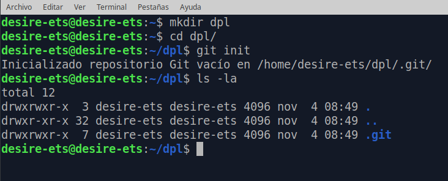

# Tarea 2: Manipulación de repositorios en Git

## Índice

1. [Tareas](#id1)

    1.1. [Tarea: Configuración](#id2)

    1.2. [Tarea: Creación de un repositorio](#id3)

    1.3. [Tarea: Comprobar el estado del respositorio](#id4)

    1.4. [Tarea: Realizando Commit's](#id5)

    1.5. [Tarea: Modificación de ficheros](#id6)

    1.6. [Tarea: Historial](#id7)

## 1. Tareas<a name="id1"></a>
### 1.1. Tarea: Configuración<a name="id2"></a>


<div style="text-align: justify">

Configuramos Git con nuestro nombre de usuarios, nuestro correo, y activamos el coloreado de salida.

````
git config --global user.name "desire"
git config --global user.email "alvarezdaisy16@gmail.com"
git config --global color.ui auto
git config --list
````

<div align="center">


</div>

### 1.2. Tarea: Creación de un repositorio<a name="id3"></a>

<div style="text-align: justify">

Crear un repositorio nuevo con el nombre **dpl** y mostrar el contenido.

````
mkdir dpl
cd dpl
git init
ls -la
````

<div align="center">



</div>

### 1.3. Tarea: Comprobar el estado del repositorio<a name="id4"></a>

<div style="text-align: justify">

- Comprobar el estado del repositorio.

  ````
  git status
  ````

  <div align="center">

  

  </div>

<div style="text-align: justify">

- Crear un fichero indice.txt con el siguiente contenido:

  - Capítulo 1: Instalación de Git por la alumna Desiré
  - Capítulo 2: Flujo de trabajo básico

    ````
    touch indice.txt
    sudo nano indice.txt  
    ````

    <div align="center">

    

    

    </div>

    ````
    cat indice.txt
    ````

    <div align="center">

    

    </div>

- Comprobar de nuevo el estado del repositorio.

  ````
  git status
  ````

  <div align="center">

  

  </div>


- Añadir el fichero a la zona de intercambio temporal.
- Volver a comprobar el estado del repositorio.

  ````
  git add indice.txt
  git status
  ````

  <div align="center">

  

  </div>

### 1.4. Tarea: Realizando Commit's<a name="id5"></a>

<div style="text-align: justify">

Realizar un commit de los últimos cambios con el mensaje "Añadido índice de la asignatura DPL." y comprobar el estado del repositorio.

````
git commit -m "Añadido índice de la asignatura DPL."
git status
````

<div align="center">


</div>


### 1.5. Tarea: Modificación de ficheros<a name="id6"></a>

<div style="text-align: justify">

- Cambiar el fichero para que contenga lo siguiente:

  - Capítulo 1: Instalación de Git por la alumna Desiré
  - Capítulo 2: Flujo de trabajo básico
  - Capítulo 3: Gestión de ramas
  - Capítulo 4: Repositorios remotos

  ````
  sudo nano indice.txt
  cat indice.txt
  ````

  <div align="center">

  

  </div>

<div style="text-align: justify">

- Mostrar los cambios con respecto a la última versión guardada en el repositorio.

  ````
  git diff

  ````

  <div align="center">

  

  </div>

- Añadir el fichero índice y hacer un commit de los cambios.

  ````
  git add indice.txt
  git commit -m "Añadido los capitulos 3"

  ````

  <div align="center">

  

  </div>

### 1.6. Tarea: Historial<a name="id7"></a>

<div style="text-align: justify">

- Mostrar los cambios de la última versión del repositorio con respecto a la anterior.

  ````
  git show
  ````

  <div align="center">

  

  </div>

- Cambiar el mensaje del último commit por "Añadido el capítulo sobre gestión de ramas al índice".

  ````
  git commit --amend -m "Añadido el capítulo sobre gestión de ramas al índice."
  ````

  <div align="center">

  

  </div>

- Volver a mostrar los últimos cambios del repositorio.

  ````
  git show
  ````

  <div align="center">

  

  </div>
