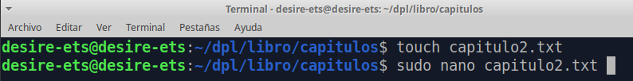

# EJEMPLOS EN GIT

<div style="text-align: justify">

Antes de hacer los ejercicios deberemos haber hecho, [Tarea 1](../GIT/Tarea1/README.md), y [Tarea 2](../GIT/Tarea2/README.md). Ahora haremos un clon del repositorio: https://github.com/jpexposito/libro , para empezar a trabajar a partir de ese repositorio.

````
git clone https://github.com/jpexposito/libro
cd libro
````

<div align="center">


</div>

## Índice

1. [Ejercicio 1:](#id1)

2. [Ejercicio 2:](#id2)

3. [Ejercicio 3:](#id3)

4. [Ejercicio 4:](#id4)

5. [Ejercicio 5:](#id5)

6. [Ejercicio 6:](#id6)

7. [Ejercicio 7:](#id7)

8. [Ejercicio 8:](#id8)

9. [Ejercicio 9:](#id9)

## 1. Ejercicio 1: <a name="id1"></a>

<div style="text-align: justify">

- Mostramos el historial de cambios del repositorio.

  ````
  git show
  ````

<div align="center">


</div>

- Crear la carpeta capítulos y crear dentro de ella el fichero **capitulo1.txt** con el siguiente texto.

````
mkdir capítulos
cd capítulos/
````

<div align="center">


</div>

````
touch capitulo1.txt
sudo nano capitulo1.txt
cat capitulo1.txt
'Git es un sistema de control de versiones ideado por Linus Torvalds.'
````

<div align="center">


</div>

- Añadir los cambios a la zona de intercambio temporal.

````
git add capítulos/
````
<div align="center">


</div>

- Hacer un commit de los cambios con el mensaje **Añadido capítulo 1.**

````
git commit -m "Añadido el capítulo 1."
````

<div align="center">


</div>

- Volver a mostrar el historial de cambios del repositorio.

````
git show
````

<div align="center">



</div>


## 2. Ejercicio 2: <a name="id2"></a>

<div style="text-align: justify">

## 3. Ejercicio 3: <a name="id3"></a>
