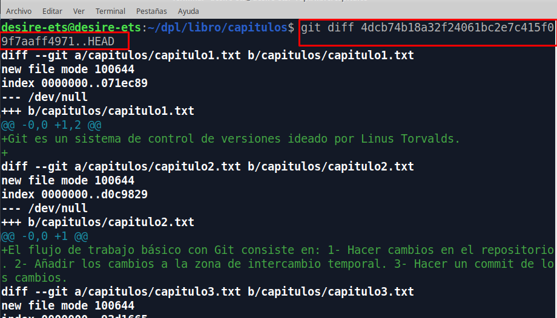
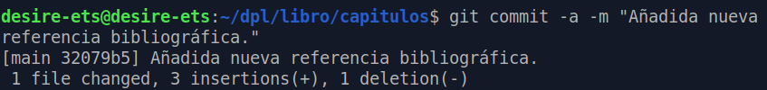

# EJEMPLOS EN GIT

<div style="text-align: justify">

Antes de hacer los ejercicios deberemos haber hecho, [Tarea 1](./GIT/Tarea1/README.md), y [Tarea 2](./GIT/Tarea2/README.md). Ahora haremos un clon del repositorio: https://github.com/jpexposito/libro , para empezar a trabajar a partir de ese repositorio.

````
git clone https://github.com/jpexposito/libro
cd libro
````

<div align="center">


</div>

## Índice

1. [Ejercicio 1:](#id1)

2. [Ejercicio 2:](#id2)

3. [Ejercicio 3:](#id3)

4. [Ejercicio 4:](#id4)

5. [Ejercicio 5:](#id5)

6. [Ejercicio 6:](#id6)

7. [Ejercicio 7:](#id7)

8. [Ejercicio 8:](#id8)

9. [Ejercicio 9:](#id9)

## 1. Ejercicio 1: <a name="id1"></a>

<div style="text-align: justify">

- Mostramos el historial de cambios del repositorio.

  ````
  git show
  ````

  <div align="center">

  

  </div>

- Crear la carpeta capítulos y crear dentro de ella el fichero **capitulo1.txt** con el siguiente texto.

  ````
  mkdir capítulos
  cd capítulos/
  ````

  <div align="center">

  

  </div>

  ````
  touch capitulo1.txt
  sudo nano capitulo1.txt
  cat capitulo1.txt
  'Git es un sistema de control de versiones ideado por Linus Torvalds.'
  ````

  <div align="center">

  
  

  </div>

- Añadir los cambios a la zona de intercambio temporal.

  ````
  git add capítulos/
  ````
  <div align="center">

  

  </div>

- Hacer un commit de los cambios con el mensaje **Añadido capítulo 1.**

  ````
  git commit -m "Añadido el capítulo 1."
  ````

  <div align="center">

  

  </div>

- Volver a mostrar el historial de cambios del repositorio.

  ````
  git show
  ````

  <div align="center">

  

  </div>


## 2. Ejercicio 2: <a name="id2"></a>

<div style="text-align: justify">

- Crear el fichero **capitulo2.txt** en la carpeta capítulos con el siguiente texto.

  ````
  El flujo de trabajo básico con Git consiste en:
  1- Hacer cambios en el repositorio.
  2- Añadir los cambios a la zona de intercambio temporal.
  3- Hacer un commit de los cambios.
  ````

  <div align="center">

  

  </div>

- Añadir los cambios a la zona de intercambio temporal, y hacer un commit de los cambios con el mensaje **Añadido capítulo 2.**

  ````
  git add capítulos/
  git commit -m "Añadido capítulo 2."
  ````

  <div align="center">

  

  </div>

- Mostrar las diferencias entre la última versión y dos versiones anteriores.

  ````
  git diff HEAD~2..HEAD
  ````

  <div align="center">

  

  </div>


## 3. Ejercicio 3: <a name="id3"></a>

<div style="text-align: justify">

- Crear el fichero capitulo3.txt en la carpeta capítulos con el siguiente texto:

  ````
  Git permite la creación de ramas lo que permite tener distintas versiones del mismo proyecto y trabajar de manera simultanea en ellas.
  ````

  ````
  touch capitulo3.txt
  sudo nano capitulo3.txt
  cat capitulo3.txt  
  ````

  <div align="center">

  

  

  </div>

- Añadir los cambios a la zona de intercambio temporal y hacer un commit con el mensaje **Añadido capítulo 3**.

  ````
  git add capitulo3.txt
  git commit -m "Añadido capitulo 3."
  ````

  <div align="center">

  

  </div>

- Mostrar las diferencias entre la primera y la última versión del repositorio.

  ````
  git log
  git diff [codigo commit]..HEAD
  ````
  <div align="center">

  

  

  

  </div>

## 4. Ejercicio 4: <a name="id4"></a>

<div style="text-align: justify">

- Crear en el fichero **índice.txt** la siguiente línea:

  ````
  Indice de los capítulos, con conceptos avanzados de git
  ````

  ````
  touch indice.txt
  sudo nano indice.txt
  cat indice.txt
  ````

  <div align="center">

  

  </div>

- Añadir los cambios a la zona de intercambio temporal.

  ````
  git add .
  ````

  <div align="center">

  

  </div>


- Hacer un commit de los cambios con el mensaje **Indice de los capítulos, con conceptos avanzados de git**.

  ````
  git commit -m "Indice de los capitulos, con conceptos avanzados de git"
  ````

  <div align="center">

  

  </div>

- Mostrar quien ha hecho cambios sobre el fichero **indice.txt**.

  ````
  git annotate índice.txt
  ````


  <div align="center">

  

  </div>


## 5. Ejercicio 5: <a name="id5"></a>

<div style="text-align: justify">

- Crear una nueva rama *bibliografía* y mostrar las ramas del repositorio.

  ````
  git branch bibliografía
  git branch -a
  ````

  <div align="center">

  

  

  </div>

## 6. Ejercicio 6: <a name="id6"></a>

<div style="text-align: justify">

- Crear el fichero capitulos/capitulo4.txt y añadir el text siguiente:

  ````
  En este capítulo veremos cómo usar GitHub para alojar repositorios en remoto.
  ````

  <div align="center">

  

  </div>

- Añadir los cambios a la zona de intercambio temporal, y hacer un commit con el mensaje **Añadido capítulo 4.**

  ````
  git add .
  git commit -m "Añadir capítulo 4."
  ````

  <div align="center">

  

  </div>

- Mostrar la historia del repositorio incluyendo todas las ramas.

  ````
  git log --graph --all --oneline
  ````

  <div align="center">

  

  </div>

## 7. Ejercicio 7: <a name="id7"></a>

<div style="text-align: justify">

- Cambiar a la rama *bibliografía*.

  ````
  git checkout bibliografía
  ````

  <div align="center">

  

  </div>

- Crear el fichero bibliografía.txt y añadir la siguiente referencia:

  ````
  Chacon, S. and Straub, B. Pro Git. Apress.
  ````

  ````
  touch bibliografía.txt
  sudo nano bibliografía.txt
  cat bibliografía.txt
  ````

  <div align="center">

  

  </div>

- Añadir los cambios a la zona de intercambio temporal, hacer un commit con el mensaje "Añadida primera referencia bibliográfica".

  ````
  git add bibliografía.txt
  git commit -m "Añadida primera referencia bibliográfica."
  ````

  <div align="center">

  

  </div>

- Mostrar la historia del repositorio incluyendo todas las ramas.

````
git log --graph --all --oneline
````

<div align="center">


</div>

## 8. Ejercicio 8: <a name="id8"></a>

<div style="text-align: justify">

- Fusionar la rama bibliografía con la rama main.

  ````
  git checkout main
  ````

  <div align="center">

  

  </div>

- Mostrar la historia del repositorio incluyendo todas las ramas.

  ````
  git merge bibliografía
  ````

  <div align="center">

  

  

  </div>

- Eliminar la rama bibliografía. Mostrar de nuevo la historia del repositorio incluyendo todas las ramas.

````
git branch -d bibliografía
git log --graph --all --oneline
````

<div align="center">


</div>


## 9. Ejercicio 9: <a name="id9"></a>

<div style="text-align: justify">

- Crear la rama bibliografía, y cambiar a la rama bibliografía.

  ````
  git branch bibliografía
  git checkout bibliografía
  ````

  <div align="center">

  

  </div>

- Cambiar el fichero bibliografía.txt para que contenga las siguientes referencias:

  ````
  Scott Chacon and Ben Straub. Pro Git. Apress.
  Ryan Hodson. Ry’s Git Tutorial. Smashwords (2014)
  ````

  <div align="center">

  

  </div>


- Cambiar a la rama main.

  ````
  git checkout main
  ````

  <div align="center">

  

  </div>

- Cambiar el fichero bibliografía.txt para que contenga las siguientes referencias:

  ````
  sudo nano bibliografia.txt
  cat bibliografia.txt
  ````

  ````
  Chacon, S. and Straub, B. Pro Git. Apress.
  Loeliger, J. and McCullough, M. Version control with Git. O’Reilly.
  ````

  <div align="center">

  

  </div>

- Añadir los cambios a la zona de intercambio temporal y hacer un commit con el mensaje "Añadida nueva referencia bibliográfica".

  ````
  git commit -a -m "Añadida nueva referencia bibliográfica."
  ````

  <div align="center">

  

  </div>

- Fusionar la rama bibliografía con la rama main.

  ````
  git merge bibliografía
  ````

  <div align="center">

  

  </div>

- Resolver el conflicto dejando el fichero bibliografía.txt con las siguientes referencias:

  ````
  Chacon, S. and Straub, B. Pro Git. Apress.
  Loeliger, J. and McCullough, M. Version control with Git. O’Reilly.
  ````

  ````
  sudo nano bibliografía.txt
  cat bibliografia.txt
  ````

  <div align="center">

  

  </div>

- Añadir los cambios a la zona de intercambio temporal y hacer un commit con el mensaje **"Resuelto conflicto de bibliografía."**

  ````
  git commit -a -m "Resuelto conflicto de bibliografia."
  ````

  <div align="center">

  

  </div>

- Mostrar la historia del repositorio incluyendo todas las ramas.

  ````
  git log --graph --all --online
  ````

  <div align="center">

  

  </div>
