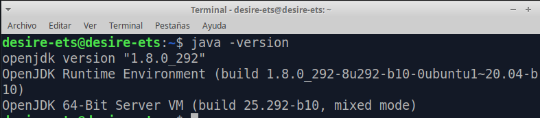

# ETS

## Instalación del IDE IntelliJ IDEA

## Índice

1. [Pasos](#ide1)
2. [Instalación](#ide2)
3. [Lanzamiento de IntelliJ](#ide3)

## 1. Pasos <a name="ide1"></a>

Comprobamos la versión de java que tengamos en el equipo.

````
java -version
````



## 2. Instalación <a name="ide2"></a>
Instalamos la edición community, con el siguiente comando:

````
sudo snap install intellij-idea-community --classic
````


## 3. Lanzamiento de IntelliJ <a name="ide3"></a>

Iniciamos el programa desde el menú de nuestro SO.


