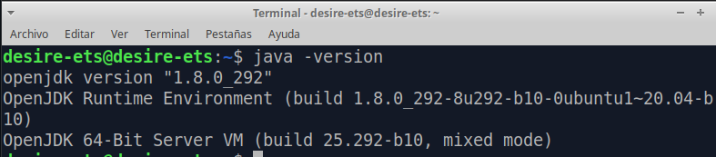
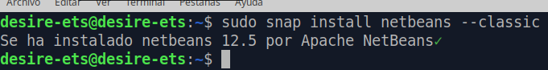
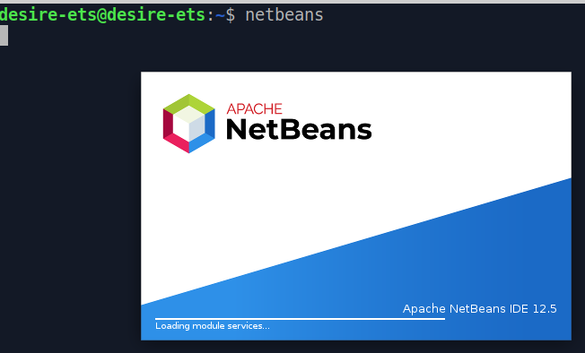

# ETS

# Instalación del IDE Netbeans 12

## Índice

1. [Prerrequisitos](#ide1)
2. [Instalación](#ide2)
3. [Ejecutando Netbeans 12](#ide3)

## 1. Prerrequisitos <a name="ide1"></a>

Para la Instalación de Netbeans debemos tener instalado Java y Maven.

````
java -version
````



## 2. Instalación <a name="ide2"></a>

Para instalar la versión 12 de Netbeans, podemos descargarla desde su página web oficial, o mediante el siguiente comando.

````
sudo snap install netbeans --classic
````


Cuando veamos el mensaje 'netbeans 12.5 from Apache NetBeans✓ installed' ha terminado la instalación.


## 3. Ejecutando Netbeans 12 <a name="ide3"></a>
Ahora podremos ejecutar el programa.


