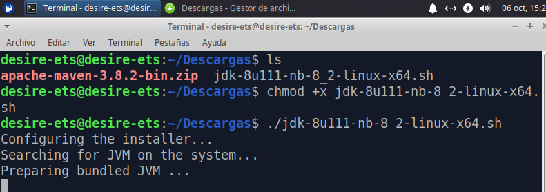
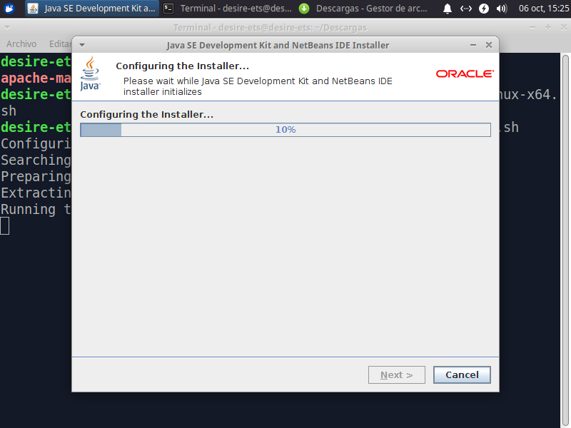
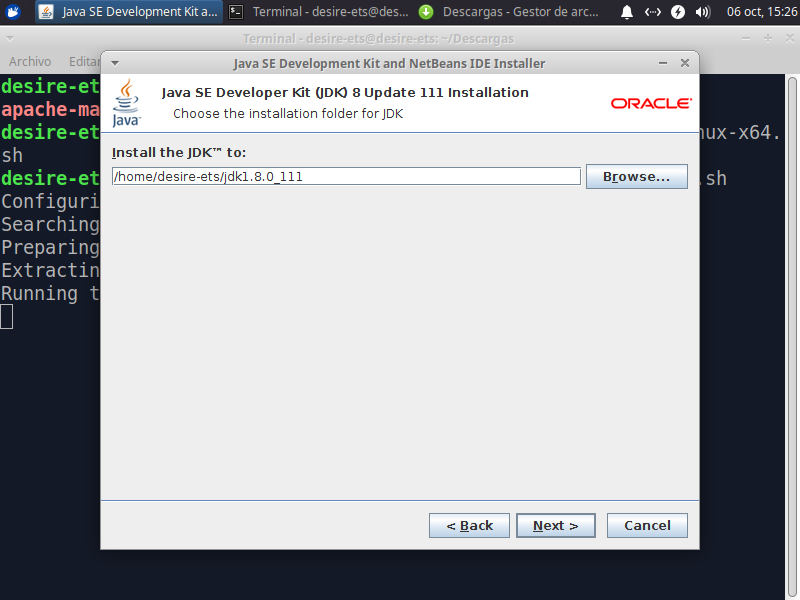
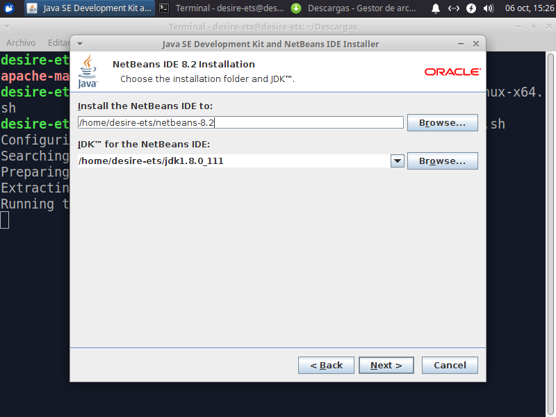
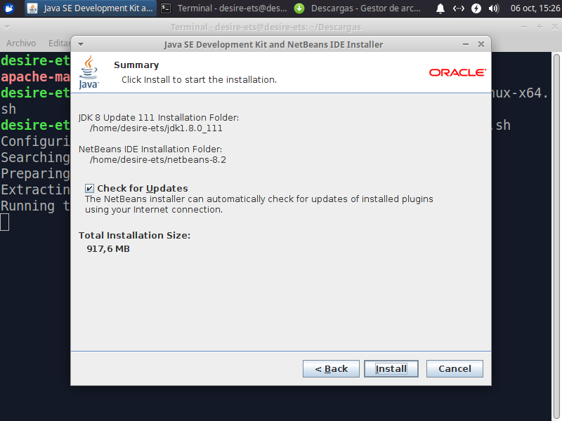
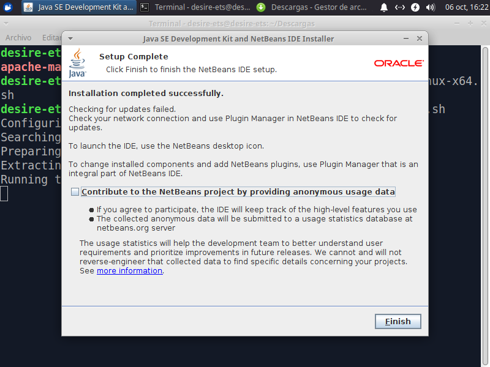
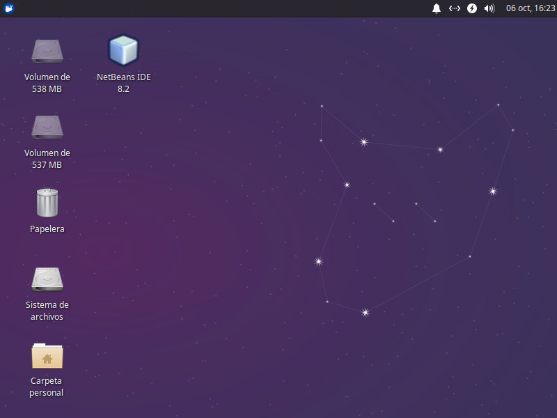

# ETS

## Instalación del IDE Netbeans 8

## Índice

1. [1. Pasos](#ide1)

Para instalar otra versión del IDE Netbeans, deberemos comprobar la versión de java que tengamos instalada.

````
java -version
````


## 1. Pasos <a name="ide1"></a>

  - Esta vez descargaremos la versión de Netbeans desde la página web.
[Netbeans 8](https://www.oracle.com/technetwork/java/javase/downloads/jdk-netbeans-jsp-3413139-esa.html).


  - Después de la descarga, abriremos un terminal desde la carpeta donde se nos haya descargado. Cambiamos los permisos del archivo con chmod para hacerlo ejecutable.

````
chmod +x jdk-8u111-nb-8_2-linux-x64.sh
````
> Y lo ejecutamos

````
./jdk-8u111-nb-8_2-linux-x64.sh
````



  - Después de ejecutarlo se abrira el asistente de isntalación de Netbeans8.



- Ahora seleccionamos en que carpeta, y en que cuenta queremos que se nos instale.



  - Nos detecta las versiones de OpenJDK que tengamos instaladas, y escogemos la 1.8



  - Activamos la comprobación de las actualizaciones.



  - Una vez, termine la instlación, seleccionaremos 'Finish', y reiniciamos la máquina.



- Luego de reiniciar la máquina, el programa nos aparecerá en el escritorio.


