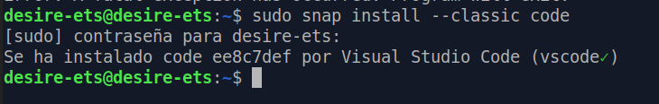

# ETS

## Instalación del IDE VS-Code

## Índice

1. [Prerrequisitos](#ide1)
2. [Instalación](#ide2)


## 1. Prerrequisitos <a name="ide1"/>

Comprobamos la versión de java que tengamos en nuestro equipo, con el siguiente comando:

``````
java -version
``````


## 2. Instalación

Podemos instalar VS-Code desde la terminal con el siguiente comando:
````
sudo snap install --classic

````


## 3. Lanzamiento de VS-Code

Para iniciar VS-Code, podemos buscarlo en el menú de nuestro SO.


## 4. Extensiones Necesarias

Para empezar a trabajar con VS-Code deberemos añadir algunas extensiones, para mayor comodidad a la hora de trabajar, ya que algunas nos autocompletaran el código, los atributos...En nuestro caso, la extension que nos será de más utilidad, serán las relacionadas con Java, en concretro el *Java Extension Pack*, que contiene las siguientes extensiones:

- Test Runner for Java
- Maven for Java


